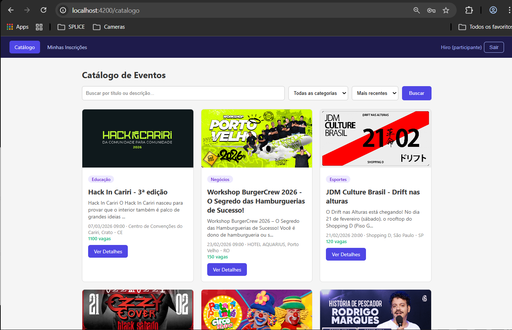
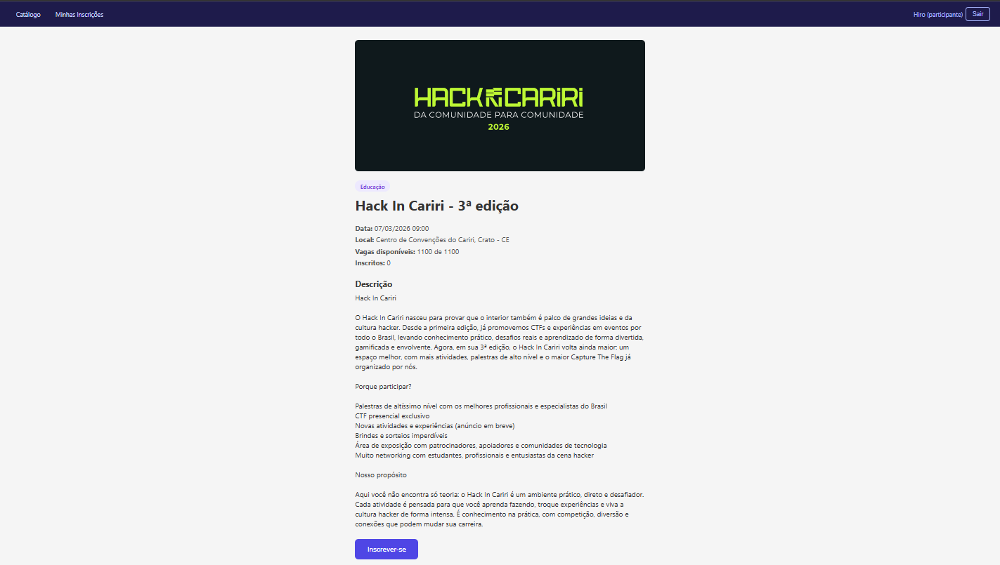
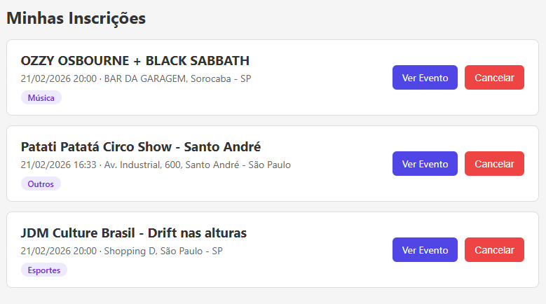

# Gerenciador de Eventos

Front-end do sistema de gerenciamento de eventos, construído com Angular 21.

Esse projeto consome a API REST (Node.js + Express) e implementa todas as telas tanto do Organizador quanto do Participante.


## Como rodar

1. Clonar o repo **com o submodule** do back-end:
```bash
git clone --recurse-submodules <url-deste-repo>
```

> Se já clonou sem o flag, rode:
> ```bash
> git submodule update --init --recursive
> ```

2. Instalar dependências do front-end:
```bash
npm install
```

3. Subir o servidor de dev:
```bash
npm start
```

4. Acessar: [http://localhost:4200](http://localhost:4200)

## Funcionalidades

### Autenticação (simplificada)
- Tela de cadastro com seleção de perfil (Organizador ou Participante)
- Tela de login
- Navegação muda conforme o perfil logado

Utilizamos um sistema de autenticação simplificado, sem tokens ou senhas reais, apenas para fins de demonstração. O back-end aceita qualquer email e senha, e retorna um usuário com o perfil escolhido no cadastro.

### Organizador
- **Meus Eventos**: lista os eventos criados com status (Futuro / Ocorrendo / Finalizado)
- **Criar Evento**: formulário com título, descrição, data/hora, local, categoria, vagas e imagem
- **Editar Evento**: mesmo formulário preenchido com dados existentes
- **Ver Inscritos**: tabela com nome, email e data de inscrição de cada participante

### Participante
- **Catálogo**: lista todos os eventos disponíveis com filtro por categoria, busca por texto e ordenação por data
- **Detalhes do Evento**: mostra todas as informações, vagas restantes e botão de inscrição
- **Minhas Inscrições**: lista eventos nos quais está inscrito, com opção de cancelar

## Screenshots

**Catálogo de Eventos**


**Detalhes do Evento**


**Minhas Inscrições**


## Estrutura principal

```
src/app/
├── services/
│   ├── api.service.ts       # chamadas HTTP pra API
│   └── auth.service.ts      # estado do usuário logado
├── login/                   # tela de login
├── registro/                # tela de cadastro
├── organizador/
│   ├── meus-eventos/        # listagem dos eventos do organizador
│   ├── form-evento/         # criar / editar evento
│   └── inscritos/           # inscritos por evento
├── participante/
│   ├── catalogo/            # catálogo geral de eventos
│   ├── evento-detalhe/      # detalhes + inscrição
│   └── minhas-inscricoes/   # inscrições do participante
├── app.routes.ts            # rotas
├── app.ts                   # componente raiz
├── app.html                 # navbar dinâmica
└── app.config.ts            # providers (HttpClient, Router)
```

## Back-end (submodule)

O back-end está incluído nesse repo como **git submodule**, apontando para a branch `feature/AtividadeFinal` do repositório:

> https://github.com/GabrielHiro/ControleFinanceiro-API-REST

A pasta `ControleFinanceiro-API-REST/` contém a API REST feita com Node.js + Express + MongoDB. Para rodar:

```bash
cd ControleFinanceiro-API-REST
# crie o .env com base no .env.example
npm install
npm run dev
```

A API sobe em `http://localhost:3000`.

## Stack

- Angular 21 (standalone components)
- TypeScript
- RxJS
- Angular Router
- HttpClient

## Autor
- **Gabriel Hiro Furukawa** - RA: 223190
- **Rafael Perassi** - RA: 161134
